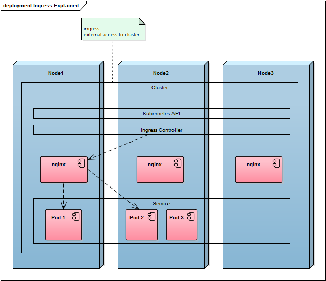
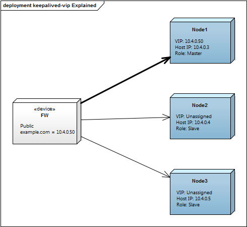

[background-color="#303030"]
= Kubernetes Ingress 
Hello-World sample for deploying on premises

[background-color="#303030"]
== Goals 

* first understanding of kubernetes concepts
* see development and production environment
* feeling for on premises environment

[background-color="#326de6"]
== kubernetes concepts

[background-color="#326de6"]
=== pod
* atomic building block
* one (sometimes more) container
* colocated, shared ports, shared volumes
* mortal: they are born and they die

[background-color="#326de6"]
=== node
* pods run on nodes
* worker machine

[background-color="#326de6"]
=== service
* cluster internal abstraction to access set of pods
* unique name
* labels & selectors: e.g. "release" : "stable", "environment" : "dev"
* cluster internal virtual ip, port
* routing by iptables, kube-proxy

[background-color="#326de6"]
=== deployment
* describe how pods should run
* desired count of replicas
* labels & selectors
* update strategy

[background-color="#326de6"]
=== ingress
* manages external access to the services in a cluster
* mostly http based
* ssl termination
* load balancing
* name based virtual hosting
* bypasses service and kube-proxy because of session affinity

[background-color="#326de6"]
=== !

[background-color="#326de6"]
=== node failover
* DNS based or
* external load balancers or
* VIP based - e.g. keepalived-vip:

[background-color="#326de6"]
=== !

[background-color="#326de6"]
=== ConfigMaps
* inject containers with configuration data
  by command line, env variables or volume
* granuarity
  name/value pairs or entire config files

[background-color="#326de6"]
=== secrets
* similar to ConfigMaps, more restricted
* name/value pairs
* certificates
* no entire config file

[background-color="#326de6"]
=== other concepts
* annotations: like labels 
  but "non-identifying metadata"
* namespaces: allows multiple virtual clusters 
  in the same physical cluster

[background-color="#c9e9ec"]
== minikube live demo 

minikube is a minimal kubernetes VM for developers

[background-color="#c9e9ec"]
=== minikube startup
:source-highlighter: highlightjs
[source,bash]
----
sudo minikube start
# if you are behind a proxy
# minikube.exe start --docker-env http_proxy=192.168.1.1:3128 --docker-env https_proxy=192.168.1.1:3128

# optional: cleanup of previous try:
sudo minikube addons disable ingress
kubectl delete deployment,service echoserver
kubectl delete deployment,service munich
kubectl delete deployment,service paris
kubectl delete ingress kubernetes-ingress-hello-world
kubectl delete secret tls-certificate
----

[background-color="#c9e9ec"]
=== minikube docker enironment
:source-highlighter: highlightjs
[source,bash]
----
eval $(sudo minikube docker-env)
docker build -t hello-service hello-service/ 
# if you are behind a proxy
# docker build --build-arg HTTP_PROXY=http://192.168.1.1:3128 --build-arg HTTPS_PROXY=http://192.168.1.1:3128 -t hello-service hello-service/
docker run -ti hello-service
----

[background-color="#c9e9ec"]
=== create pods & services

* existing sample from google "echoserver"
* own node based "hello-service"

:source-highlighter: highlightjs
[source,bash]
----
kubectl run echoserver --image=gcr.io/google_containers/echoserver:1.4 --port=8080
kubectl expose deployment echoserver --type=NodePort
# sudo minikube service echoserver

kubectl run munich --image=hello-service:latest --image-pull-policy=Never --env="GREETINGS=grias-eich" --port=80
kubectl expose deployment munich --type=NodePort
# sudo minikube service munich

kubectl run paris --image=hello-service:latest --image-pull-policy=Never --env="GREETINGS=bonjour" --port=80
kubectl expose deployment paris --type=NodePort
# sudo minikube service paris
----

[background-color="#c9e9ec"]
=== create secrets
:source-highlighter: highlightjs
[source,bash]
----
openssl req -x509 -nodes -days 365 -newkey rsa:2048 -keyout ./tls.key -out ./tls.crt -config <(
cat <<-EOF
[req]
default_bits = 2048
prompt = no
default_md = sha256
req_extensions = req_ext
distinguished_name = dn
x509_extensions = req_ext

[ dn ]
CN = greetings.toall
C = DE
ST = BY
L = Munich
O = Muenchhausen
OU = Muenchhausen

[ req_ext ]
subjectAltName = @alt_names

[ alt_names ]
DNS.1 = greetings.toall
DNS.2 = munich.greetings.toall
DNS.3 = paris.greetings.toall
EOF
)
----

:source-highlighter: highlightjs
[source,bash]
----
kubectl create secret tls tls-certificate --key ./tls.key --cert ./tls.crt
----

[background-color="#c9e9ec"]
=== create ingress
:source-highlighter: highlightjs
[source,bash]
----
sudo minikube addons enable ingress
kubectl create --validate=false -f kubernetes-ingress-hello-world.yaml
# kubectl describe ing kubernetes-ingress-hello-world

# Browser: https://paris.greetings.toall/
# Browser: https://greetings.toall/paris
# Browser: https://munich.greetings.toall/
# Browser: https://greetings.toall/munich
# Browser: https://greetings.toall/

# kubectl get pods --all-namespaces --watch
# kubectl.exe logs munich-xxxxxxx
# kubectl scale deployment munich --replicas=3
# minikube dashboard

# add ips to hosts file:
# echo "$(sudo minikube ip) echo.toall greetings.toall paris.greetings.toall munich.greetings.toall" | sudo tee -a /etc/hosts
----

[background-color="#c9e9ec"]
=== alternative ingress controllers

* kubernetes/ingress-nginx 	
* nginxinc/kubernetes-ingress with NGINX 	
* nginxinc/kubernetes-ingress with NGINX Plus 	
* haproxy based (upcomming)		

[background-color="#ffffff"]
== kubespray live demo 

* scripts to deploy production ready kubernetes cluster
* supports: AWS, GCE, Azure, OpenStack or Baremetal
* Ansible based

[background-color="#303030"]
== references
* https://kubernetes.io/docs/reference/kubectl/docker-cli-to-kubectl/[kubectl for docker users]
* https://github.com/kubernetes/ingress-nginx/tree/master/deploy#minikube[kubernetes howto: nginx ingress]
* https://github.com/nginxinc/kubernetes-ingress/blob/master/docs/nginx-ingress-controllers.md[ingress controller alternatives]
* https://medium.com/@Oskarr3/setting-up-ingress-on-minikube-6ae825e98f82[howto: setting up ingress on minikube]
* https://github.com/kubernetes/contrib/tree/master/ingress/controllers/nginx/examples/tls[howto: nginx ingress ssl termination]
* https://github.com/kubernetes/ingress-nginx/issues/1374[issue: nginx ingress certificate]
* https://daemonza.github.io/2017/02/13/kubernetes-nginx-ingress-controller/[howto: Kubernetes nginx-ingress-controller]
* https://github.com/kubernetes/contrib/tree/master/keepalived-vip[keepalived-vip]
* https://github.com/kubernetes-incubator/kubespray[kubespray]
